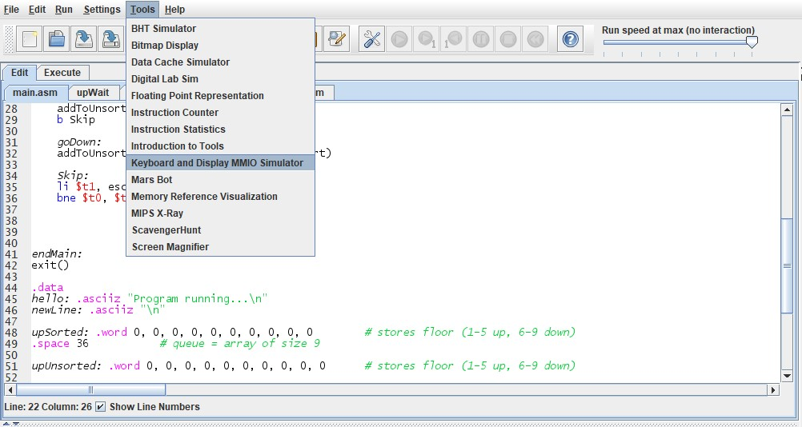
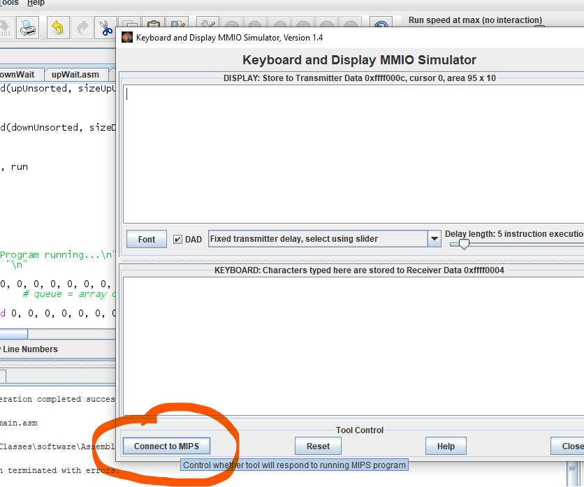

# Elevator simulator

## Connecting to the keyboard

1. Click on `tools` on top menu bar
2. Select `Keyboard and Display MMO Simulator`

   

3. Once open compile the `main.asm` to start the program
4. Select `Connect to MIPS`
   

5. Run `main.asm`
6. In the opened keyboard window, click the bottom white space above `connect to mips` button to begin typing.
7. Just type.

## Coding conventions

1. Writing a procedure:

```asm
fx:
  add $t0, $0, $t1
  ...
endFx:
jr $ra
```

2. Printing, check `macro.asm` if a function exists
3. writing a loop:

```asm
main:
  ...
  loop:
    ori $t0, $0, 12
    ...
  bne $t1, $t2, loop
  ...
endMain:
```

4. Pushing and poping to stack, check `macro.asm`

```asm
main:
  ...
  push $ra
  ...
  pop $ra
  ...
endMain:
```
